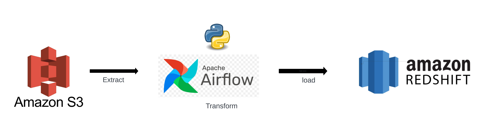
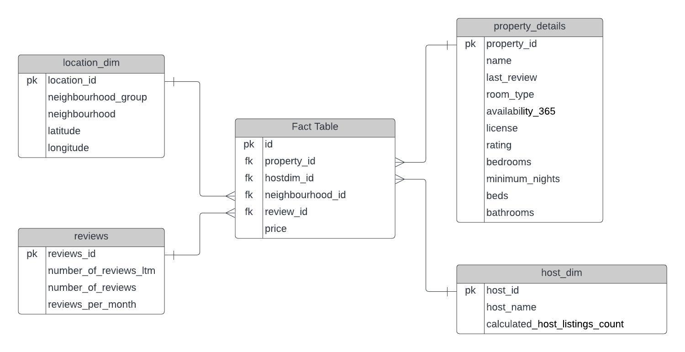

# AIRBNB DATA ANALYTICS PROJECT

### INTRODUCTION
The goal of this project is to perform data analytics on Airbnb data using various tools and technologies, including s3 Storage, Python, airflow and Redshift.

### Architecture

# Technology Used
 . Programming Language - Python
Amazon s3
airflow
Redshift

# DATAMODEL

# ETL Flow
    * Data is stored in aws s3 and the file is being published to the airflow dag for further processing.
    * First task of the dag is to fetch data from S3 
    * Second task is to transform the data .
    * Third task is to load the transformed data in the Redshift.
